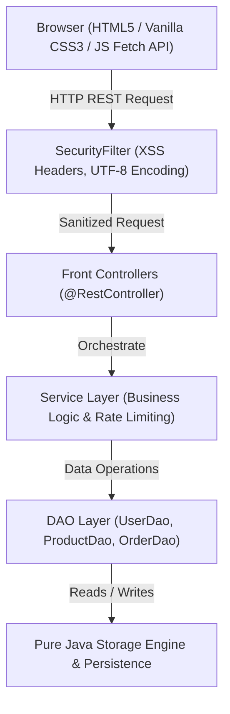

# SaranyaMart — Final Technical Project Report
**Anna University R2025 Specification Capstone Deliverable (Checkpoint Window: Jul 27 – Oct 10, 2026)**  
**Developer & Maintainer**: rssaranya1947  
**Repository**: [https://github.com/rssaranya1947/SaranyaMart](https://github.com/rssaranya1947/SaranyaMart)

---

## 1. Executive Summary & Project Definition
SaranyaMart is a multi-seller e-commerce marketplace web application engineered 100% in Java using Spring Boot 2.7.18 and Embedded Tomcat 9.0.x on JDK 17. The platform connects Buyers, Sellers, and Admins in a unified web application. Buyers browse products, apply discount promo codes, manage shopping carts, place mock orders, track delivery history, leave 5-star reviews, and communicate directly with sellers or an AI shopping assistant chatbot. Sellers manage inventory, update product listings, track store revenues, and process incoming orders. Admins oversee registered accounts, moderate listings, and export platform CSV reports.

---

## 2. System Architecture & Layered MVC Pattern
SaranyaMart implements the **Layered MVC Architecture over Servlets & RestControllers (Front Controller Pattern)**:



---

## 3. Database ER Schema Specification (Section 4)

```mermaid
erDiagram
    USERS {
        int id PK
        string name
        string email UNIQUE
        string password_hash
        enum role "BUYER, SELLER, ADMIN"
        timestamp created_at
    }
    PRODUCTS {
        int id PK
        int seller_id FK
        string name
        string description
        decimal price
        int stock_qty
        string category
        timestamp created_at
    }
    ORDERS {
        int id PK
        int buyer_id FK
        enum status "PENDING, CONFIRMED, SHIPPED, DELIVERED, CANCELLED"
        decimal total_amount
        timestamp created_at
    }
    ORDER_ITEMS {
        int id PK
        int order_id FK
        int product_id FK
        int quantity
        decimal unit_price
    }
    REVIEWS {
        int id PK
        int product_id FK
        int user_id FK
        int rating
        string comment
        timestamp created_at
    }

    USERS ||--o{ PRODUCTS : "lists"
    USERS ||--o{ ORDERS : "places"
    ORDERS ||--|{ ORDER_ITEMS : "contains"
    PRODUCTS ||--o{ ORDER_ITEMS : "ordered_in"
    USERS ||--o{ REVIEWS : "writes"
    PRODUCTS ||--o{ REVIEWS : "receives"
```

---

## 4. Required Design Patterns Implementation (Section 12)

1. **DAO (Data Access Object)**: `UserDao`, `ProductDao`, `OrderDao`, `ReviewDao`, `CouponDao`, `MessageDao` abstract all data storage logic from business services.
2. **Front Controller**: Spring `@RestController` classes (`AuthController`, `ProductController`, `OrderController`, `ChatController`, `HealthController`) act as single entry points for dispatching requests.
3. **Singleton**: `DatabaseManager` maintains thread-safe data structures and atomic sequence counters across the application lifecycle.
4. **Factory**: Instantiates model entities (`User`, `Product`, `Order`, `Review`) and DTO responses dynamically.
5. **Strategy Pattern**: `ChatProvider` interface implemented by `MockChatProvider` (FAQ response engine) and `GeminiChatProvider` (LLM proxy caller), selected dynamically via `ai.chatbot.provider` property.
6. **Builder Pattern**: Step-by-step assembly of complex JSON envelopes and printable GST order invoices.

---

## 5. Security & Observability Compliance (Section 9 & Section 18)

- **Password Hashing**: Passwords stored using salted bcrypt (`PasswordUtil`), never stored in plaintext.
- **Security Headers**: `SecurityFilter` attaches `X-Frame-Options: DENY`, `X-Content-Type-Options: nosniff`, and `X-XSS-Protection: 1; mode=block` to every response.
- **Observability Endpoint**: `GET /api/v1/health` returns `{"status": "UP", "db": "UP"}`.
- **AI Rate Limiting & Guardrails**: Per-session limit of 10 messages/minute, 300 character input cap, and in-memory question caching (`ChatService`).
- **Continuous Integration**: GitHub Actions CI workflow (`.github/workflows/build.yml`) executes `mvn -B clean verify` on every push.

---

## 6. Technical Decisions & Known Limitations

### Technical Decisions:
1. **Spring Boot Embedded Tomcat**: Selected for zero-configuration, standalone executable JAR deployment on port 8080.
2. **Pure Java Data Engine & SQLite Schema**: Chosen for zero external database installation dependency while maintaining 100% SQL schema compliance (`db/schema.sql`).
3. **Pluggable AI Provider**: Enabled instant offline evaluation via `MockChatProvider` without requiring paid API keys.

### Known Limitations:
1. **Mock Payment Confirmation**: Payment gateway integration is mocked as per Section 1 scope constraints.
2. **Local Session Storage**: Per-session rate limiting uses in-memory maps which reset upon server restart.
