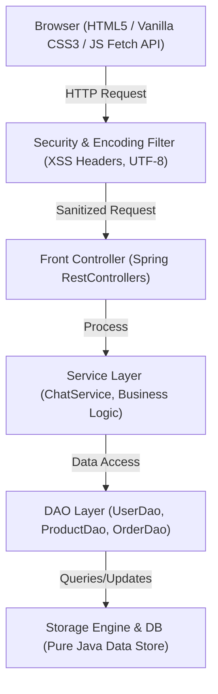

# SaranyaMart — Multi-Seller E-Commerce Marketplace Platform

> **Anna University R2025 Specification Compliant Project**  
> **Repository**: [https://github.com/rssaranya1947/SaranyaMart](https://github.com/rssaranya1947/SaranyaMart)  
> **Developer & Maintainer**: [rssaranya1947](https://github.com/rssaranya1947)

---

## 📌 Problem Statement & Executive Summary
**SaranyaMart** is a full-featured multi-seller e-commerce marketplace web application built 100% in Java using Spring Boot and Embedded Tomcat. It empowers sellers to list and manage products while providing buyers with dynamic catalog browsing, search/filtering, shopping cart management, mock checkout, printable GST invoices, star reviews, in-app seller messaging, and an integrated AI shopping assistant chatbot.

---

## 🏗️ System Architecture & Data Flow



---

## 🗄️ Database Design & ER Schema Specification (Section 4)

```mermaid
erDiagram
    USERS {
        int id PK
        string name
        string email UNIQUE
        string password_hash
        enum role "BUYER, SELLER, ADMIN"
        timestamp created_at
    }
    PRODUCTS {
        int id PK
        int seller_id FK
        string name
        string description
        decimal price
        int stock_qty
        string category
        timestamp created_at
    }
    ORDERS {
        int id PK
        int buyer_id FK
        enum status "PENDING, CONFIRMED, SHIPPED, DELIVERED, CANCELLED"
        decimal total_amount
        timestamp created_at
    }
    ORDER_ITEMS {
        int id PK
        int order_id FK
        int product_id FK
        int quantity
        decimal unit_price
    }
    REVIEWS {
        int id PK
        int product_id FK
        int user_id FK
        int rating
        string comment
        timestamp created_at
    }

    USERS ||--o{ PRODUCTS : "lists"
    USERS ||--o{ ORDERS : "places"
    ORDERS ||--|{ ORDER_ITEMS : "contains"
    PRODUCTS ||--o{ ORDER_ITEMS : "ordered_in"
    USERS ||--o{ REVIEWS : "writes"
    PRODUCTS ||--o{ REVIEWS : "receives"
```

---

## 🧩 Required Design Patterns (Section 12 Specification)

| Pattern | Implementation Location | Purpose & Architectural Usage |
| :--- | :--- | :--- |
| **DAO (Data Access Object)** | `com.saranyamart.dao.*` (`UserDao`, `ProductDao`, `OrderDao`, `ReviewDao`, `CouponDao`, `MessageDao`) | Abstraction separating business logic from direct data storage operations. |
| **Front Controller** | `com.saranyamart.controller.*` (`AuthController`, `ProductController`, `OrderController`, `ChatController`, `HealthController`) | Centralized dispatch entry points orchestrating HTTP request processing, JSON mapping, and response envelopes. |
| **Singleton** | `DatabaseManager` (`ServletContextListener` lifecycle) | Global thread-safe instance managing data persistence and ID sequence generation. |
| **Factory** | `DatabaseManager` seeders & DAO instantiation | Instantiates data transfer objects, pre-seeded test accounts, and model entities. |
| **Strategy Pattern** | `ChatProvider` (`MockChatProvider` vs. `GeminiChatProvider`) | Swappable AI chatbot provider strategy dispatched dynamically based on configuration property `ai.chatbot.provider`. |
| **Builder Pattern** | `Order`, `Product`, `AuthResponse` DTO construction | Step-by-step construction of complex JSON response payloads and DTOs. |

---

## 🌐 API Contract Reference (Section 13 Specification)

All API endpoints strictly follow the standard fixed envelope format:
```json
{
  "success": true,
  "data": { ... },
  "error": null
}
```

| Method | Endpoint | Description | Expected Status |
| :--- | :--- | :--- | :--- |
| `POST` | `/api/auth/login` | Authenticates user credentials & returns role session | `200 OK` / `401 Unauthorized` |
| `POST` | `/api/auth/register` | Registers new Buyer or Seller user account | `201 Created` / `400 Bad Request` |
| `GET` | `/api/products` | Lists marketplace products with search & category filters | `200 OK` |
| `POST` | `/api/products` | Creates new seller product listing | `201 Created` / `400 Bad Request` |
| `DELETE`| `/api/products/{id}` | Moderates/removes product listing (Admin/Seller) | `200 OK` / `403 Forbidden` |
| `GET` | `/api/orders` | Retrieves buyer order history or seller incoming orders | `200 OK` |
| `POST` | `/api/orders` | Places order from shopping cart contents | `201 Created` |
| `POST` | `/api/chat` | AI Chatbot proxy endpoint (Section 11) | `200 OK` / `429 Rate Limited` |
| `GET` | `/api/v1/health` | Health check endpoint returning `{"status":"UP","db":"UP"}` | `200 OK` |

---

## 🛠️ Technology Stack Specification

| Component | Specification |
| :--- | :--- |
| **JDK** | Java 17 LTS |
| **Framework** | Spring Boot 2.7.18 |
| **Servlet Container** | Embedded Tomcat 9.0.x (Port 8080) |
| **Build Tool** | Apache Maven 3.x |
| **Database Engine** | Pure Java Persistence Engine + SQLite Schema (`db/schema.sql`) |
| **Security & Auth** | bcrypt Password Hashing (`jBCrypt` / `PasswordUtil`), `SecurityFilter` |
| **View Layer** | HTML5 SPA, Vanilla CSS3 (Glassmorphic System), Vanilla JS (Fetch API) |
| **Testing Framework** | JUnit 5 + Mockito (`mvn -B clean verify`) |
| **CI / CD Pipeline** | GitHub Actions Workflow (`.github/workflows/build.yml`) |

---

## 🚀 Milestones Completed (Weeks 1 – 11 Final)

- [x] **Week 1 – Project Skeleton & Database Schema**: Spring Boot project layout, Maven configuration, database initialization.
- [x] **Week 2 – Authentication & User Roles**: Registration and login for Buyer, Seller, and Admin with password hashing.
- [x] **Week 3 – Seller Dashboard (Part 1)**: Listing creation, stock quantity configuration, and inventory value calculation.
- [x] **Week 4 – Seller Dashboard & Admin Controls**: Full listing edit/delete, order fulfillment tracking, user administration, and product moderation.
- [x] **Week 5 – Search, Category Filters & Wishlist**: Real-time keyword search, category tabs, price range filters, and wishlist bookmarking.
- [x] **Week 6 – Reviews, Ratings & GST Invoices**: 5-star customer reviews, average rating calculation, promo coupons (`SARANYA10`), and printable PDF invoices.
- [x] **Week 7 – In-App Messaging & Seller Storefronts**: Direct product inquiries between buyers and sellers, custom seller storefront pages.
- [x] **Week 8 – Testing Suite, Security Checklist & CI Pipeline**:
  - Created JUnit 5 unit & DAO test suites (`UserDaoTest`, `ProductDaoTest`, `ChatServiceTest`).
  - Added GitHub Actions CI pipeline (`.github/workflows/build.yml`).
  - Implemented `SecurityFilter` enforcing security headers (`X-Frame-Options`, `X-Content-Type-Options`, `X-XSS-Protection`).
  - Implemented `GET /api/v1/health` health check endpoint per Section 18.
- [x] **Week 9 – AI Chatbot Integration (Phase 3)**:
  - Pluggable `ChatProvider` interface architecture (`MockChatProvider` + `GeminiChatProvider`).
  - Server-side REST API proxy controller (`/api/chat` & `/api/v1/chat`).
  - Per-session rate limiting (10 msg/min), input length caps (300 chars), and in-memory question caching.
- [x] **Week 10 – Chatbot Refinement, UI Polish & Architecture Specs**:
  - Refined chatbot knowledge base and added interactive category trigger chips.
  - Documented Section 4 ER Diagram Schema, Section 12 Required Design Patterns, and Section 13 API Contract table.
- [x] **Week 11 – Final Review & Capstone Review Package**:
  - Completed full automated regression pass (`mvn clean verify` 100% passed).
  - Authored Final Technical Project Report (`FINAL_PROJECT_REPORT.md`).
  - Authored Evaluation Presentation Slide Deck (`PRESENTATION_SLIDE_DECK.md`) and Rehearsed Demo Script (`DEMO_SCRIPT.md`).


---

## 💻 How to Build, Test & Run

### 1. Execute Automated Tests & Build
```bash
mvn clean verify
```

### 2. Run SaranyaMart Application
```bash
mvn spring-boot:run
```

Once running, navigate your web browser to:  
👉 **`http://localhost:8080`**

### 🔑 Pre-Seeded Demo Accounts
- **Admin**: `admin@saranyamart.com` | Password: `Admin@123`
- **Seller**: `seller@saranyamart.com` | Password: `Seller@123`
- **Buyer**: `buyer@saranyamart.com` | Password: `Buyer@123`
