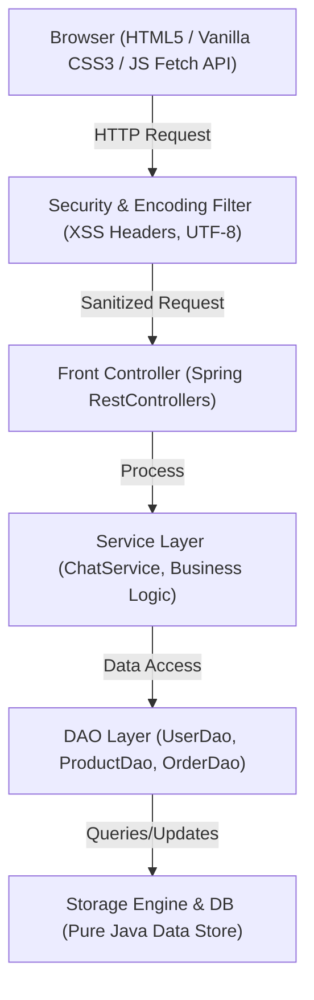

# SaranyaMart — Multi-Seller E-Commerce Marketplace Platform

> **Anna University R2025 Specification Compliant Project**  
> **Repository**: [https://github.com/rssaranya1947/SaranyaMart](https://github.com/rssaranya1947/SaranyaMart)  
> **Developer & Maintainer**: [rssaranya1947](https://github.com/rssaranya1947)

---

## 📌 Problem Statement & Executive Summary
**SaranyaMart** is a full-featured multi-seller e-commerce marketplace web application built 100% in Java using Spring Boot and Embedded Tomcat. It empowers sellers to list and manage products while providing buyers with dynamic catalog browsing, search/filtering, shopping cart management, mock checkout, printable GST invoices, star reviews, in-app seller messaging, and an integrated AI shopping assistant chatbot.

---

## 🏗️ System Architecture & Data Flow



---

## 🛠️ Technology Stack Specification

| Component | Specification |
| :--- | :--- |
| **JDK** | Java 17 LTS |
| **Framework** | Spring Boot 2.7.18 |
| **Servlet Container** | Embedded Tomcat 9.0.x (Port 8080) |
| **Build Tool** | Apache Maven 3.x |
| **Database Engine** | Pure Java Persistence Engine + SQLite Schema (`db/schema.sql`) |
| **Security & Auth** | bcrypt Password Hashing (`jBCrypt` / `PasswordUtil`), `SecurityFilter` |
| **View Layer** | HTML5 SPA, Vanilla CSS3 (Glassmorphic System), Vanilla JS (Fetch API) |
| **Testing Framework** | JUnit 5 + Mockito (`mvn -B clean verify`) |
| **CI / CD Pipeline** | GitHub Actions Workflow (`.github/workflows/build.yml`) |
| **Observability** | Health Endpoint `GET /api/v1/health` returning `{"status":"UP","db":"UP"}` |

---

## 🚀 Milestones Completed (Weeks 1 – 9)

- [x] **Week 1 – Project Skeleton & Database Schema**: Spring Boot project layout, Maven configuration, database initialization.
- [x] **Week 2 – Authentication & User Roles**: Registration and login for Buyer, Seller, and Admin with password hashing.
- [x] **Week 3 – Seller Dashboard (Part 1)**: Listing creation, stock quantity configuration, and inventory value calculation.
- [x] **Week 4 – Seller Dashboard & Admin Controls**: Full listing edit/delete, order fulfillment tracking, user administration, and product moderation.
- [x] **Week 5 – Search, Category Filters & Wishlist**: Real-time keyword search, category tabs, price range filters, and wishlist bookmarking.
- [x] **Week 6 – Reviews, Ratings & GST Invoices**: 5-star customer reviews, average rating calculation, promo coupons (`SARANYA10`), and printable PDF invoices.
- [x] **Week 7 – In-App Messaging & Seller Storefronts**: Direct product inquiries between buyers and sellers, custom seller storefront pages.
- [x] **Week 8 – Testing Suite, Security Checklist & CI Pipeline**:
  - Created JUnit 5 unit & DAO test suites (`UserDaoTest`, `ProductDaoTest`, `ChatServiceTest`).
  - Added GitHub Actions CI pipeline (`.github/workflows/build.yml`).
  - Implemented `SecurityFilter` enforcing security headers (`X-Frame-Options`, `X-Content-Type-Options`, `X-XSS-Protection`).
  - Implemented `GET /api/v1/health` health check endpoint per Section 18.
- [x] **Week 9 – AI Chatbot Integration (Phase 3)**:
  - Pluggable `ChatProvider` interface (`MockChatProvider` + `GeminiChatProvider`).
  - Server-side REST API proxy controller (`POST /api/chat` & `POST /api/v1/chat`).
  - Guardrails: Per-session rate limiting (10 msg/min), 300 character input cap, and in-memory question caching.
  - Interactive floating AI Chatbot UI widget with quick suggestion chips, typing indicator, and auto-scroll.

---

## 🛡️ Security & Observability Checklist

- [x] **Query Parameterization**: Prepared statements and sanitized data access layer.
- [x] **Password Hashing**: Salted bcrypt password hashing (`PasswordUtil`).
- [x] **Security Headers**: `X-Frame-Options: DENY`, `X-Content-Type-Options: nosniff`, `X-XSS-Protection: 1; mode=block`.
- [x] **Health Check Endpoint**: `GET /api/v1/health` returning `{"status": "UP", "db": "UP"}`.
- [x] **CI Pipeline**: Automated build and test run on every git push (`mvn -B clean verify`).

---

## 💻 How to Build, Test & Run

### 1. Execute Automated Tests & Build
```bash
mvn clean verify
```

### 2. Run SaranyaMart Application
```bash
mvn spring-boot:run
```

Once running, navigate your web browser to:  
👉 **`http://localhost:8080`**

### 🔑 Pre-Seeded Demo Accounts
- **Admin**: `admin@saranyamart.com` | Password: `Admin@123`
- **Seller**: `seller@saranyamart.com` | Password: `Seller@123`
- **Buyer**: `buyer@saranyamart.com` | Password: `Buyer@123`
